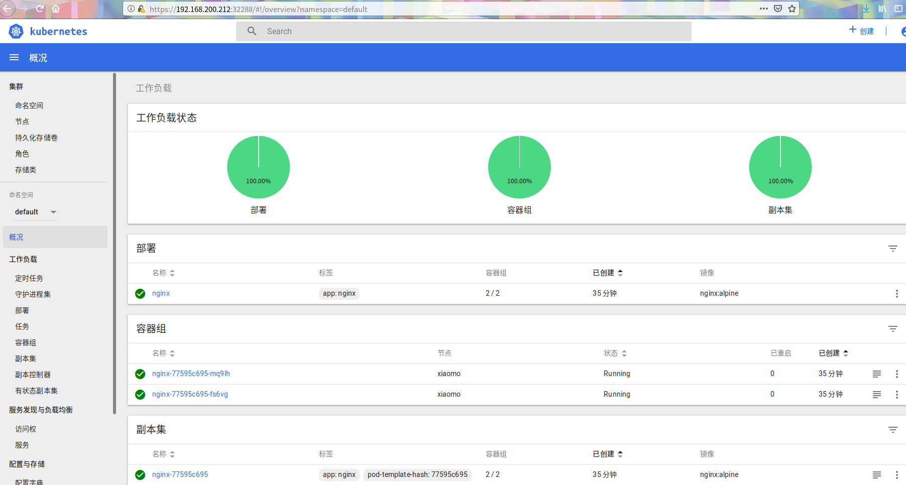

## 1.拉取docker镜像

```bash
docker pull registry.cn-hangzhou.aliyuncs.com/google_containers/kubernetes-dashboard-amd64:v1.10.1
docker tag registry.cn-hangzhou.aliyuncs.com/google_containers/kubernetes-dashboard-amd64:v1.10.1  k8s.gcr.io/kubernetes-dashboard-amd64:v1.10.1
wget https://raw.githubusercontent.com/kubernetes/dashboard/v1.10.1/src/deploy/recommended/kubernetes-
dashboard.yaml
```

## 2.修改kubernetes-dashboard.yaml(暴露端口到host)

```yaml
kind: Service
apiVersion: v1
metadata:
  labels:
    k8s-app: kubernetes-dashboard
  name: kubernetes-dashboard
  namespace: kube-system
spec:
  type: NodePort
  ports:
    - port: 443
      targetPort: 8443
      nodePort: 32288
  selector:
    k8s-app: kubernetes-dashboard
```

## 3.部署dashboard

```bash
kubectl create -f kubernetes-dashboard.yaml
kubectl get po -n kube-system
```

## 4.创建dashboard登录用户

- 创建k8s-admin-token.yaml文件, 内容如下

```yaml
kind: ClusterRoleBinding
apiVersion: rbac.authorization.k8s.io/v1beta1
metadata:
  name: admin
  annotations:
    rbac.authorization.kubernetes.io/autoupdate: "true"
roleRef:
  kind: ClusterRole
  name: cluster-admin
  apiGroup: rbac.authorization.k8s.io
subjects:
- kind: ServiceAccount
  name: admin
  namespace: kube-system
---
apiVersion: v1
kind: ServiceAccount
metadata:
  name: admin
  namespace: kube-system
  labels:
    kubernetes.io/cluster-service: "true"
    addonmanager.kubernetes.io/mode: Reconcile
```

- 配置admin token

```bash
kubectl create -f k8s-admin-token.yaml
```

## 6.动态获取登录token

```bash
kubectl describe secret/$(kubectl get secret -nkube-system |grep admin|awk '{print $1}') -nkube-system
```

## 7.浏览器打开dashboard登录，将上面获取的token粘贴到令牌输入框

```
打开地址: https://<你的ip>:32288
```

